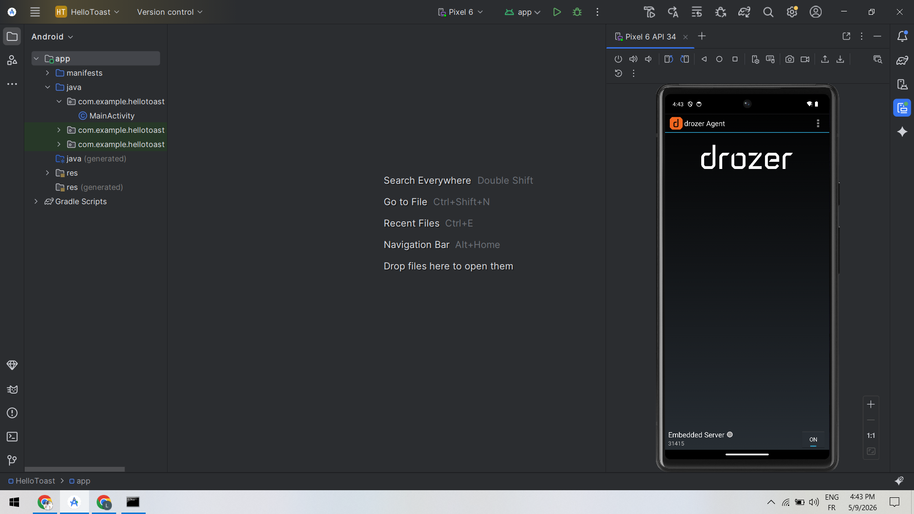
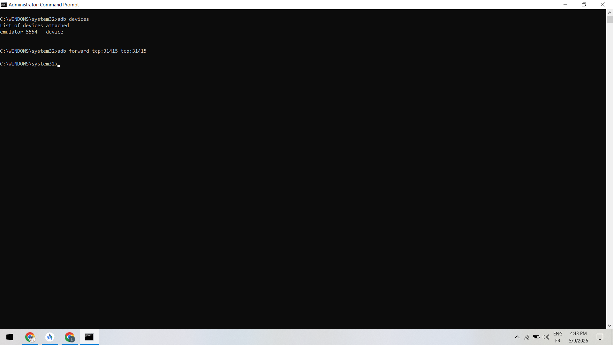
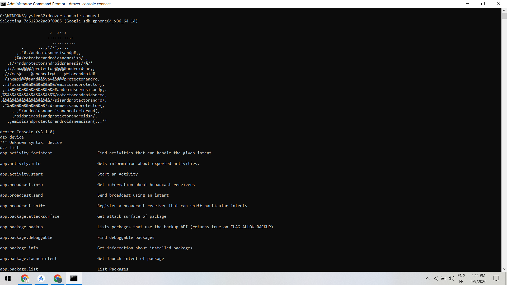
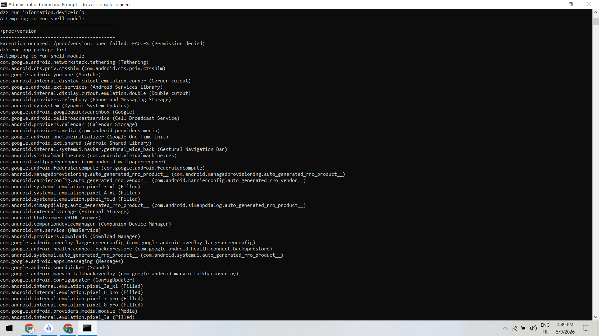
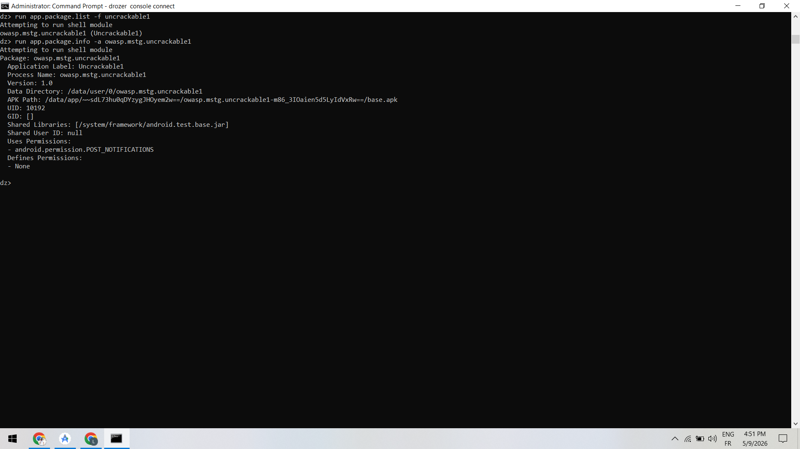
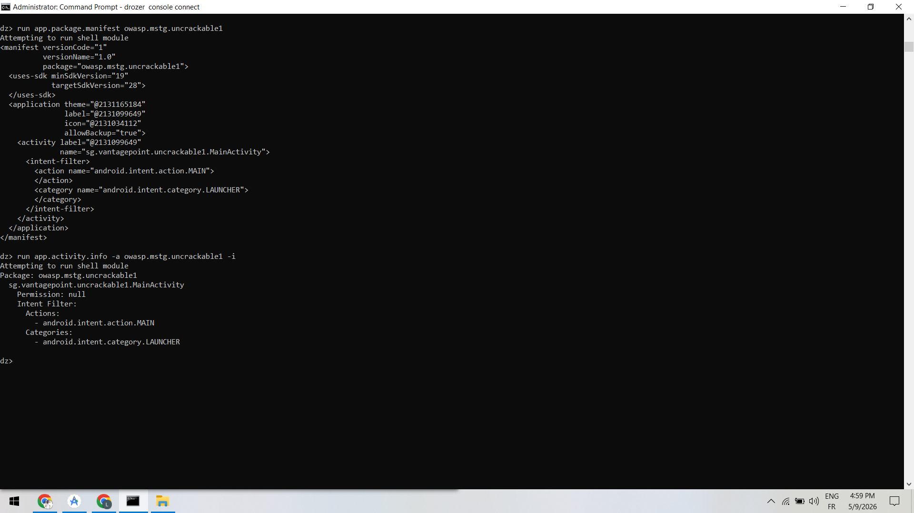
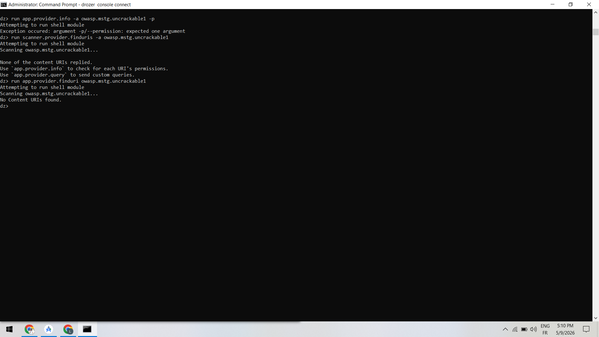

# Rapport d'audit de sécurité Android avec Drozer

## Informations générales

* **Application analysée** : Uncrackable1
* **Package** : owasp.mstg.uncrackable1
* **Version** : 1.0
* **Plateforme** : Android Emulator API 34
* **Outil principal** : Drozer v3.1.0
* **Date de l’analyse** : 09/05/2026
* **Auditeur** : Gomi Mustapha

---

# Résumé exécutif

Cette analyse de sécurité a été réalisée sur l’application Android `Uncrackable1` en utilisant l’outil Drozer.

L’objectif était d’identifier les composants Android exposés et d’évaluer les risques potentiels liés à leur exportation.

Les résultats montrent que :

* une seule Activity est exportée ;
* aucun Service exporté n’a été détecté ;
* aucun Broadcast Receiver exporté n’a été détecté ;
* aucun Content Provider accessible n’a été identifié ;
* le manifeste Android contient `allowBackup="true"`.

La surface d’attaque observée reste limitée, mais certaines configurations peuvent être améliorées afin de renforcer la sécurité de l’application.

---

# Méthodologie

Les étapes suivantes ont été réalisées :

1. Vérification de l’environnement Android
2. Installation et configuration de Drozer
3. Connexion à l’agent Drozer sur l’émulateur
4. Identification des packages installés
5. Analyse du manifeste Android
6. Analyse des Activities exportées
7. Analyse des Services exportés
8. Analyse des Broadcast Receivers
9. Analyse des Content Providers
10. Évaluation des risques

---

# 1. Préparation de l’environnement

## Vérification de l’émulateur Android et du port forwarding

Les commandes suivantes ont été utilisées :

```bash
adb devices
adb forward tcp:31415 tcp:31415
```

Résultat observé :

* émulateur détecté correctement ;
* port forwarding configuré avec succès.

## Capture à insérer



---

# 2. Vérification de l’agent Drozer

L’application Drozer Agent a été lancée sur l’émulateur Android.

Le serveur embarqué Drozer a été activé sur le port 31415.

## Capture à insérer

```md

```

---

# 3. Connexion à Drozer

Connexion réalisée avec la commande :

```bash
drozer console connect
```

Une connexion réussie à l’émulateur Android a été établie.

La commande `list` a également été utilisée afin d’afficher les modules disponibles dans Drozer.

## Capture à insérer

```md

```

---

# 4. Analyse des informations système et packages installés

Les commandes suivantes ont été exécutées :

```bash
run information.deviceinfo
run app.package.list
```

Résultats observés :

* tentative d’accès aux informations système ;
* restriction d’accès à `/proc/version` ;
* affichage des packages installés sur l’émulateur Android.

## Capture à insérer

```md

```

---

# 5. Identification de l’application cible

Les commandes suivantes ont été exécutées :

```bash
run app.package.list -f uncrackable1
run app.package.info -a owasp.mstg.uncrackable1
```

Informations récupérées :

* nom du package ;
* version de l’application ;
* chemin APK ;
* permissions utilisées ;
* UID de l’application.

Observation importante :

L’application utilise :

```text
android.permission.POST_NOTIFICATIONS
```

## Capture à insérer

```md

```

---

# 6. Analyse du manifeste Android et des Activities

Les commandes suivantes ont été exécutées :

```bash
run app.package.manifest owasp.mstg.uncrackable1
run app.activity.info -a owasp.mstg.uncrackable1 -i
```

Résultats observés :

* présence de `allowBackup="true"` ;
* exportation de `MainActivity` ;
* présence des intents `MAIN` et `LAUNCHER`.

Activity détectée :

| Activity                                  | Exportée | Permission |
| ----------------------------------------- | -------- | ---------- |
| sg.vantagepoint.uncrackable1.MainActivity | Oui      | Aucune     |

## Risques identifiés

### MainActivity exportée

**Risque :**
Accès direct à l’Activity principale.

**Impact potentiel :**
Un attaquant pourrait tenter d’interagir directement avec l’Activity via des intents.

### allowBackup activé

**Risque :**
Possibilité d’extraction des données via les mécanismes de sauvegarde Android.

**Impact potentiel :**
Accès potentiel aux données internes de l’application sur un appareil compromis.

## Capture à insérer

```md

```

---

# 7. Analyse des Content Providers

Les commandes suivantes ont été exécutées :

```bash
run app.provider.info -a owasp.mstg.uncrackable1 -p
run scanner.provider.finduris -a owasp.mstg.uncrackable1
run app.provider.finduri owasp.mstg.uncrackable1
```

Résultats observés :

* erreur liée à l’option `-p` sans argument ;
* aucun URI accessible détecté ;
* aucun Content Provider trouvé.

Conclusion :

L’application ne semble pas exposer de Content Provider accessible.

## Capture à insérer

```md

```

---

# 8. Analyse globale des composants Android

Les commandes suivantes ont été exécutées :

```bash
run app.activity.info -a owasp.mstg.uncrackable1
run app.service.info -a owasp.mstg.uncrackable1
run app.broadcast.info -a owasp.mstg.uncrackable1
run app.provider.info -a owasp.mstg.uncrackable1
```

Résultats observés :

| Type       | Résultat               |
| ---------- | ---------------------- |
| Activities | 1 Activity exportée    |
| Services   | Aucun service exporté  |
| Receivers  | Aucun receiver détecté |
| Providers  | Aucun provider détecté |

## Capture à insérer

```md

```

---

# Tableau récapitulatif des composants exposés

| Type de composant | Nom                                       | Exporté | Protection |
| ----------------- | ----------------------------------------- | ------- | ---------- |
| Activity          | sg.vantagepoint.uncrackable1.MainActivity | Oui     | Aucune     |
| Service           | Aucun                                     | Non     | —          |
| Receiver          | Aucun                                     | Non     | —          |
| Provider          | Aucun                                     | Non     | —          |

---

# Analyse des risques

## Activities exportées sans protection

### Risque

Accès direct à une activité exportée.

### Scénario d’abus

Un attaquant pourrait envoyer des intents vers l’Activity exportée.

### Impact

Interaction non autorisée avec l’application.

---

## allowBackup activé

### Risque

Extraction potentielle des données applicatives.

### Scénario d’abus

Un attaquant avec accès ADB pourrait tenter une sauvegarde de l’application.

### Impact

Compromission potentielle des données locales.

---

## Services exportés

Aucun Service exporté détecté.

---

## Broadcast Receivers exportés

Aucun Receiver exporté détecté.

---

## Content Providers exposés

Aucun Content Provider accessible détecté.

---

# Tableau de triage

| ID | Composant    | Vulnérabilité                     | Confiance | Sévérité | Impact                             | Recommandation                          | Statut       |
| -- | ------------ | --------------------------------- | --------- | -------- | ---------------------------------- | --------------------------------------- | ------------ |
| V1 | MainActivity | Activity exportée sans protection | Élevée    | Moyenne  | Accès direct à l’activité          | Ajouter des validations supplémentaires | À surveiller |
| V2 | Application  | allowBackup activé                | Élevée    | Moyenne  | Extraction potentielle des données | Désactiver allowBackup                  | À corriger   |
| V3 | Services     | Aucun service exporté             | Élevée    | Faible   | Aucun impact                       | Aucune action                           | Accepté      |
| V4 | Receivers    | Aucun receiver exporté            | Élevée    | Faible   | Aucun impact                       | Aucune action                           | Accepté      |
| V5 | Providers    | Aucun provider exposé             | Élevée    | Faible   | Aucun impact                       | Aucune action                           | Accepté      |

---

# Mapping OWASP MASVS / MASTG

| ID | Vulnérabilité                      | Référence MASVS |
| -- | ---------------------------------- | --------------- |
| V1 | Activity exportée sans protection  | MSTG-PLATFORM-1 |
| V2 | allowBackup activé                 | MSTG-STORAGE-2  |
| V3 | Validation des composants exportés | MSTG-PLATFORM-2 |

---

# Remédiations proposées

## Désactivation de allowBackup

### Avant

```xml
<application
    android:allowBackup="true">
```

### Après

```xml
<application
    android:allowBackup="false">
```

---

## Vérification des accès à MainActivity

L’Activity principale doit rester exportée car elle contient l’intent `MAIN/LAUNCHER`.

Cependant, il est recommandé de :

* ajouter des validations d’intent ;
* limiter les fonctionnalités accessibles sans authentification ;
* vérifier les appels externes.

---

# Structure du dossier de preuves

Organisation utilisée :

```text
preuves/
 ├── activities/
 ├── manifest/
 ├── providers/
 ├── receivers/
 └── services/
```

## Capture à insérer

```md

```

---

# Checklist de fin d’audit

## Conformité de l’audit

* [x] Toutes les étapes du lab ont été suivies
* [x] Tous les composants Android ont été analysés
* [x] Le tableau de triage est complet
* [x] Les remédiations proposées sont spécifiques
* [x] Le mapping OWASP MASVS est correct

## Absence de données sensibles

* [x] Aucune donnée réelle utilisateur présente
* [x] Aucun mot de passe inclus
* [x] Les captures ne contiennent pas de données sensibles
* [x] Les identifiants personnels ont été supprimés

## Qualité du rapport

* [x] Rapport structuré correctement
* [x] Vulnérabilités clairement expliquées
* [x] Recommandations actionnables
* [x] Documentation complète
* [x] Format conforme aux attentes

---

# Conclusion

L’analyse Drozer de l’application `Uncrackable1` a permis d’identifier une surface d’attaque relativement réduite.

Les résultats montrent :

* une seule Activity exportée ;
* aucun Service exposé ;
* aucun Broadcast Receiver exposé ;
* aucun Content Provider accessible.

Le principal point de sécurité identifié concerne la présence de `allowBackup="true"` dans le manifeste Android.

Cette analyse a permis de pratiquer :

* l’utilisation de Drozer ;
* l’analyse des composants Android ;
* la cartographie des surfaces d’attaque ;
* l’évaluation des risques liés aux composants exportés.
